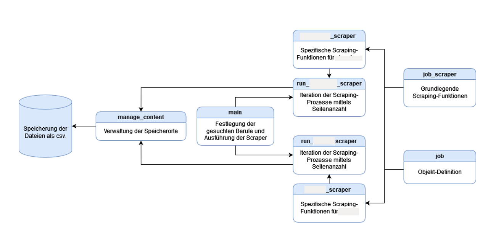

# Überblick über die Stellenangebote im Bereich Künstliche Intelligenz

## Projektbeschreibung
Dieses Repository enthält eine umfassende Analyse von Jobangeboten, die durch Scraping von verschiedenen Jobportalen im Bereich Künstliche Intelligenz durchgeführt wurde. Es werden die meist gefragten technischen Kompetenzen identifiziert, die in den Stellenangeboten für KI-Positionen erforderlich sind. Zudem wird analysiert, welche Gemeinsamkeiten zwischen den verschiedenen KI-Berufen bestehen und wie sich die Gehälter regional unterscheiden.
Die Methodik umfasst die automatisierte Erhebung und anschließende Bereinigung der Daten, um sicherzustellen, dass sie für die Analyse von hoher Qualität sind. Des Weiteren werden Muster in den Anforderungen und Qualifikationen der Jobangebote identifiziert, wobei Techniken des NLPs wie BERT und SciPy zum Einsatz kommen. Ergebnisse werden durch Grafiken und Diagramme visualisiert.

## Scraping-Prozess

Im Folgenden wird der Prozess des automatisierten Scraping von Jobangeboten dargestellt:

*Abbildung 1: Diagramm des Scraping-Prozesses*
## Projektziele
Die Hauptziele dieses Projekts sind:
- Analyse und Extraktion von relevanten Jobdaten.
- Identifikation von Anforderungen und Trends in den KI-Jobangeboten.
- Visualisierung der Ergebnisse 
